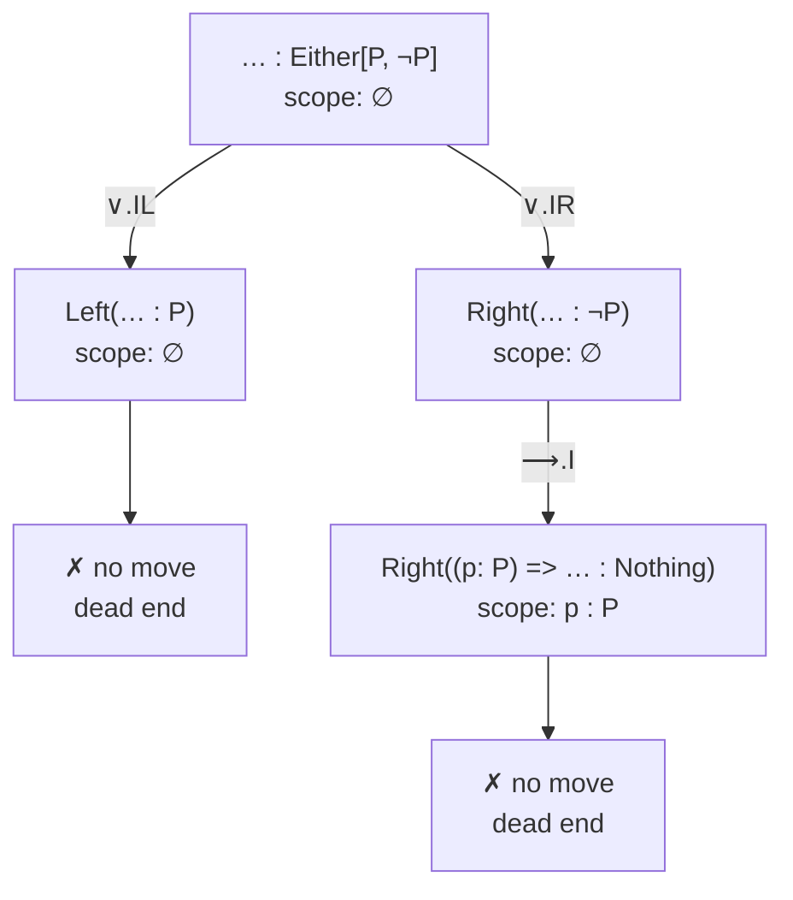
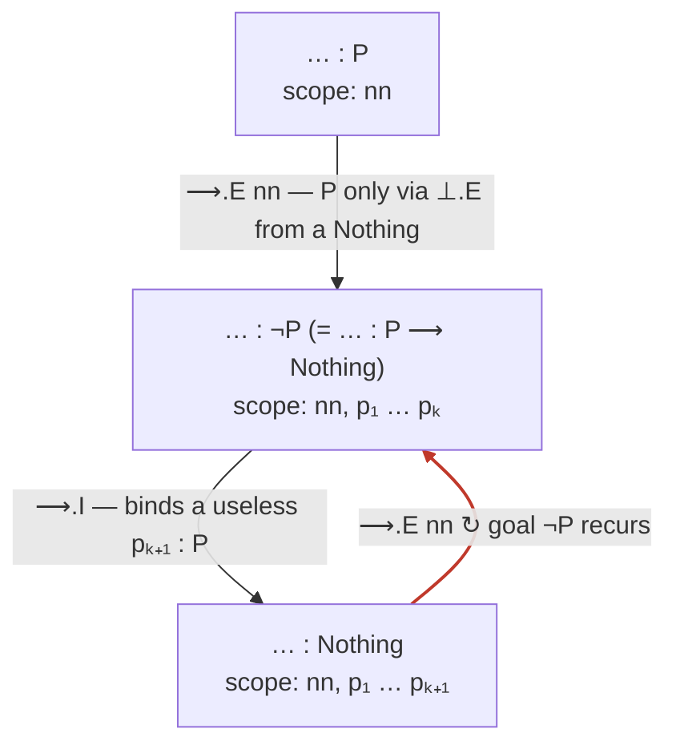

# The Curry–Howard Game — Specification

## 1 Introduction

This document specifies a game designed to teach **logic** and **programming** in
university courses on logic and declarative programming. The game is delivered as
a desktop application for the web and as a mobile application.

At its core, the game is a *gamification of logical proof systems* — such as
natural deduction — that simultaneously doubles as an exercise in *type-driven
development* for algebraic data types. The unifying principle is the
**Curry–Howard correspondence**: a proof of a proposition is the same thing as a
program inhabiting a type. The game exploits this duality so that a single
activity can be read, at will, either as *proving a theorem* or as *programming
a signature*.

The remainder of this document sets out the goals of the project (§2), the formal
core shared by logic and programming — the two parallel rule tables that will be
the starting point of the gamification (§3), an initial description of the game
itself (§4), the family of logics and programming languages it is intended to
cover (§5), and the target platforms (§6).

## 2 Goal

The central goal is to build a game that serves a **double purpose**: teaching
logic and teaching programming, through the lens of the Curry–Howard
correspondence.

### 2.1 Gamifying proof systems

The game gamifies logical proof systems, beginning with **natural deduction** for
propositional logic. The activity of constructing a proof — applying inference
rules, discharging assumptions, closing goals — is recast as gameplay.

### 2.2 Inspired by type-driven development

The design is inspired by the programming methodology of **type-driven
development** for **algebraic data types**. Just as a proof is built by
decomposing a goal according to the rules available, a program is built by
following the structure of the types involved, letting the types guide the
construction of the term.

### 2.3 Two viewpoints: proving and programming

Because of the Curry–Howard correspondence, the same task admits two readings:

- From the **logical viewpoint**, the purpose is to *prove a proposition*.
- From the **programming viewpoint**, the purpose is to *program a signature*
  (to inhabit a type).

The game is intended to make this duality explicit and switchable, so that
students experience proving and programming as two faces of one activity.

### 2.4 Not one game, but many

There is **not a single game** but **multiple games**, because there are many
logics and, correspondingly, many programming languages. Two dimensions generate
this multiplicity:

- **Different logics.** Propositional logic, first-order logic, second-order
  logic, linear logic, separation logic, and so on.
- **Different proof systems for the same logic.** Propositional logic, for
  instance, can be formalised through **natural deduction** *and* through the
  **sequent calculus**. These proof systems are not mere notational variants:
  under Curry–Howard they correspond to **very different programming languages**.

Supporting this variety — different logics *and* different proof systems for a
given logic — is an explicit goal of the application.

### 2.5 Logics and languages to be taught

It is a goal of the application to be able to teach a range of logics and their
corresponding languages, including:

- Intuitionistic propositional logic
- Classical propositional logic
- First-order logic (intuitionistic and classical)
- Second-order logic
- Linear logic
- Separation logic

This list is open-ended and expected to grow.

## 3 Two readings of one calculus

To test the main thesis of the project — *that proving a proposition can be
regarded as a game* — we fix a concrete setting:

- **The logic.** Intuitionistic propositional logic, formalised through
  **Gentzen's natural deduction** system.
- **The language.** The **simply typed λ-calculus** extended with products,
  coproducts, the unit type and the empty type — i.e. the language of
  **algebraic data types**.

Under the Curry–Howard correspondence these are *the same calculus* presented in
two syntaxes. The connectives of the logic correspond to the type formers of the
language:

| Proposition | Type (Scala) | Type former |
|---|---|---|
| $\top$ | `Unit` | unit |
| $\bot$ | `Nothing` | empty / void |
| $A \wedge B$ | `(A, B)` | product |
| $A \vee B$ | `Either[A, B]` | coproduct / sum |
| $A \rightarrow B$ | `A => B` | function |

The deeper part of the correspondence — and the substrate of the game — is that
the **inference rules** of natural deduction are in *one-to-one* correspondence
with the **constructors and destructors** of algebraic data types. We present the
two tables side by side: same structure, different syntax.

### 3.1 Natural deduction: introduction and elimination rules

For each connective, an **introduction** rule says how to *prove* (build) a
formula, and an **elimination** rule says how to *use* (consume) it. Hypotheses
written in brackets `[A]` are *discharged* by the rule; a vertical `⋮` denotes a
subderivation.

| Connective | Introduction | Elimination |
|---|---|---|
| $\rightarrow$ | $\dfrac{[A] \;\;\vdots\;\; B}{A \rightarrow B}\;{\rightarrow}\mathsf{I}$ | $\dfrac{A \rightarrow B \quad A}{B}\;{\rightarrow}\mathsf{E}$ |
| $\wedge$ | $\dfrac{A \quad B}{A \wedge B}\;{\wedge}\mathsf{I}$ | $\dfrac{A \wedge B}{A}\;{\wedge}\mathsf{E}_1 \qquad \dfrac{A \wedge B}{B}\;{\wedge}\mathsf{E}_2$ |
| $\vee$ | $\dfrac{A}{A \vee B}\;{\vee}\mathsf{I}_1 \qquad \dfrac{B}{A \vee B}\;{\vee}\mathsf{I}_2$ | $\dfrac{A \vee B \quad [A]\;\vdots\;C \quad [B]\;\vdots\;C}{C}\;{\vee}\mathsf{E}$ |
| $\top$ | $\dfrac{}{\top}\;{\top}\mathsf{I}$ | *(none)* |
| $\bot$ | *(none)* | $\dfrac{\bot}{A}\;{\bot}\mathsf{E}$ |
| *(assumption)* | *(none)* | $\dfrac{}{A}\;\mathsf{Ax}\quad(A \in \Gamma)$ |

### 3.2 Algebraic data types: constructors and destructors (the rules of the game)

This is the same table as §3.1, read through the programming viewpoint — but
stated with enough precision to serve directly as the **rules of the game**.

A program under construction contains typed **holes**, written `… : T` (the
ellipsis `…` is the syntax for a hole; `T` is the type the expression there must
have). A **move** rewrites one hole. We use the notation:

- `… : T  ⟿  e` — a hole of type `T` may be rewritten to expression `e` (a
  **constructor** move); any `… : U` inside `e` is a newly opened hole.
- `v : T  ⊢  … : H  ⟿  e` — *given a variable `v : T` in scope*, a hole `… : H`
  may be rewritten to `e` (a **destructor** move).

A move may open new holes and may bind new variables (noted in italics); a bound
variable is available only to the holes within the region where it is introduced.

| Type `T` | Constructor — *build a `… : T`* | Destructor — *use a `v : T` in scope* |
|---|---|---|
| `A => B` | `(x: A) => … : B`  *(binds `x: A`)* | `f : A => B  ⊢  … : B  ⟿  f(… : A)` |
| `(A, B)` | `(… : A, … : B)` | `p : (A, B)  ⊢  … : A  ⟿  p._1`<br>`p : (A, B)  ⊢  … : B  ⟿  p._2` |
| `Either[A, B]` | `Left(… : A)`<br>`Right(… : B)` | `e : Either[A, B]  ⊢  … : C  ⟿`<br>`e match { case Left(x: A) => … : C ;`<br>`case Right(y: B) => … : C }` |
| `Unit` | `()`  *(closes the hole)* | *(none)* |
| `Nothing` | *(none)* | `n : Nothing  ⊢  … : C  ⟿  n match {}` |
| `A` *(variable)* | *(none)* | `x : A  ⊢  … : A  ⟿  x` |

Three points of precision worth highlighting:

- **No constructor for `Nothing` or a type variable.** Every other type can be
  built by its constructor; a hole `… : Nothing` or `… : A` (with `A` a type
  variable) can be filled *only* by a destructor — i.e. by extracting from a
  variable in scope.
- **Fixed-type vs. any-type destructors.** Projections (`._1`/`._2`) and
  application fill only a hole whose type is *fixed by the variable* (a component,
  or the function's codomain). Case analysis and absurdity fill a hole of **any**
  type `C` (the elimination's *motive*, i.e. whatever the current hole's type is).
  Among destructors, only application and case analysis **open new holes**, and
  only the lambda constructor and case analysis **bind new variables** — these are
  the moves that grow the game.
- **Backward and forward use.** A destructor may be applied *backward*, to fill a
  hole whose type it matches (e.g. `x._1` directly fills a `… : P`), or *forward*,
  to **bind its result as a new in-scope variable** (e.g. `val qr: Either[Q, R] =
  x._2`, applying `∧.ER` to `x`). The forward use is how an intermediate value —
  in particular a scrutinee for `∨.E` — is brought into scope; it is the
  `val`-binding style of the notebooks. Each such application is a single move.

(The constructor/destructor names of §3.1 — `⟶.I`, `∧.EL`, `∨.E`, … — are
available as first-class Scala definitions in the notebooks, so a program can be
written to mirror a natural-deduction proof line by line.)

### 3.3 Same structure, different syntax

Reading the two tables together yields the dictionary on which the game is built:

- **Introduction rule ⟷ constructor.** Proving a formula = building a value of
  the corresponding type.
- **Elimination rule ⟷ destructor.** Using a hypothesis = consuming a value.
- **Axiom ⟷ variable.** Closing a goal from an assumption = referencing a
  variable already in scope.
- **Open goal ⟷ hole.** An unproved subgoal is a typed *hole* (`… : A`) waiting
  to be refined.

This is precisely the setting of **type-driven development**: a proof/program is
built by starting from a single hole of the goal type and repeatedly refining
holes by applying a rule from the tables, possibly opening new holes, until none
remain. The game (§4) turns this refinement process into play: a **game state**
is a collection of open goals (holes) together with the hypotheses in scope, a
**move** is the application of an introduction/elimination rule (constructor /
destructor), and a **win** is a state with no open goals — equivalently, a
completed proof and a well-typed total program.

## 4 The game

> Throughout this section we use the language of logic and of programming
> interchangeably: *proving a proposition* and *implementing a type signature* are
> the same activity, and so are *proof* and *program*, *hypothesis* and
> *variable*, *inference rule* and *constructor/destructor* (§3).

### 4.1 Why this is a game

Before describing the mechanics, it is worth justifying the name: the process of
proving a proposition (implementing a signature) by type-driven development is a
**proper game**, not merely a procedure. Two complementary lenses show this.

**The operational lens — a single-player puzzle (solitaire).** A one-player game
is given by a state space, an initial state, a set of moves constrained by rules,
terminal states, and a win condition; a *solution* is a winning strategy. Our
process supplies each element:

| Game element | In our proof / type-driven development |
|---|---|
| **State (position)** | the partial program: the set of typed **holes** plus the **variables in scope** for each |
| **Initial state** | one hole of the goal type, plus the signature's input variables |
| **Moves** | apply a **constructor** to a hole, or a **destructor** to an in-scope variable |
| **Legal-move rule** | the §3 tables: a move is legal only if the hole's type / a variable's type licenses that constructor / destructor |
| **Transition** | filling a hole, possibly opening new holes and / or binding new variables |
| **Terminal states** | *no holes left* (success) or *stuck* (dead end) |
| **Win condition** | **positive win** (all holes filled) or **negative win** (every line provably fails) |
| **Strategy / solution** | a winning strategy **is** the proof / the program |
| **Search tools** | **backtracking** over choice points; **cycle detection** to bound infinite trees |

Everything a referee or an automated solver needs — state, legal moves,
transitions, a decidable win condition — is present.

**The constitutive lens — why it counts as a game at all.** Following Bernard
Suits, *playing a game is the voluntary attempt to overcome unnecessary
obstacles*, with four components, all of which are present here:

1. **Prelusory goal** — the objective stated without reference to the game:
   *"produce a value inhabiting type `T`."*
2. **Constitutive rules** — rules that *forbid the easy means* and allow only
   harder ones. This is the crux: the term may **not** be conjured by `null`,
   `throw`, `???`, reflection or by simply asserting the theorem; it may be built
   **only** by composing the constructors and destructors of §3. The rules
   *create* the difficulty.
3. **Lusory means** — the permitted moves: exactly the rule-sanctioned
   constructor / destructor applications.
4. **Lusory attitude** — the player accepts these constraints in order to make
   the activity possible (building the term by typed construction rather than
   looking up the answer).

This is what separates the game from a mere algorithm: *type-checking a finished
term is a procedure; searching for the term under the constraint that it be built
only from the rules is the unnecessary-obstacle-overcoming activity* — a game.
The challenge is also genuine: the choices are meaningful (different branches lead
to different fates, dead ends are real) and the outcome is not known in advance
(inhabitation is decidable for intuitionistic propositional logic, but not
trivially so).

**A latent two-player structure.** The deepest justification connects the game to
an existing tradition. In **game semantics** and **dialogical logic** (Lorenzen,
Hintikka, Abramsky), *provability = existence of a winning strategy* in a debate
between a **Proponent**, who builds the proof, and an **Opponent**, who challenges
it. Our single-player game is that two-player game with the Proponent in control:
case analyses (`∨E`, pattern matching) are precisely the points where every
Opponent choice must be answered, and a **negative win** is exactly *"the Opponent
has a winning strategy."* Calling this a game is therefore not a metaphor but an
instance of a recognised correspondence between **proofs and strategies** — a
correspondence we will return to when generalising to other logics (§5).

### 4.2 Objective

The objective of the game is to show that a given **type signature can be
implemented** — equivalently, that a **type is inhabited**, that a **program of
that type exists**, or, logically, that a **proposition is provable**.

The type expression is written in the algebraic data type system of §3, which is
structured entirely in terms of **constructors and destructors**, one set per
kind of type. To produce an expression of the proposed type, the player proceeds
**step by step**, using in each step a constructor or a destructor to fill in a
gap in the program.

### 4.3 Holes

A partially written program contains **holes** (gaps): places where an expression
is still missing. Every hole is **annotated with its type** — the type of the
expression that must eventually go there.

- **Initially** nothing has been implemented, so there is a **single hole** whose
  type is the whole goal type.
- Each **move** fills one hole by applying a constructor or a destructor. Filling
  a hole may **create new holes** (the arguments that the chosen rule still
  needs), or may close it outright.
- The game is **over** for that branch when there are **no holes left**: the
  program is complete and well-typed — i.e. the proof is finished.

A hole has a **type**, and the type gives it a **shape**; constructors and
destructors are the ways of filling in that shape.

### 4.4 Moves: constructors and destructors

There are two kinds of move.

**Constructors — building an expression of a required type.**
If there is a hole of a type that *has* a constructor, that constructor can be
used to fill it. Constructors are the easy case. The only types for which **no
constructor is available** are:

- `Nothing` (the empty type, $\bot$), and
- a **type variable** (an abstract, opaque type such as `A`, `P`).

**Destructors — extracting information from a variable.**
When a hole's type is `Nothing` or a type variable, it cannot be built directly.
The only way to fill it is to **extract information from one of the variables in
scope**, by applying a **destructor** to that variable. So:

- constructors let us **create** an expression of some type;
- destructors let us **extract** information out of a variable of some type.

### 4.5 Variables as resources

**Variables are the resources of the game.** A variable is consulted only through
a destructor, and variables are how progress is made when no constructor applies.

Variables enter scope in three ways:

- as **inputs** to the signature being implemented;
- when introducing a function — the parameter bound by a **lambda expression**
  (the constructor of function types);
- when consuming a sum — the components bound by **pattern matching** (the
  destructor of `Either` / $\vee$).

Crucially, a variable is **not available everywhere**: it is in scope only for
the holes that lie within the region where it was introduced. Different holes
therefore generally have **different resources** available to them.

### 4.6 Branching, dead ends and backtracking

The game is **non-deterministic**. At a given point there may be **several
moves** available — several holes to work on, and several constructors or
destructors applicable to a hole (for example, a hole of sum type may be filled
with either `Left` or `Right`; a `Nothing`/variable hole may be attacked through
any of several variables in scope). Consequently there may be **several different
ways** to prove that the program can be implemented.

A branch may reach a **dead end**: a hole that can be filled neither by a
constructor nor by any available destructor. When this happens the player may
**backtrack** to an earlier **choice point** and try a different move.

### 4.7 Winning

There are **two ways to win**:

1. **Positive — the type is inhabited.** Some sequence of moves fills *all* the
   holes. The result is a complete, well-typed program / a finished proof.
2. **Negative — the type is uninhabited.** Every possible line of play has been
   shown to fail, proving that the signature **cannot** be implemented (the
   proposition is not a theorem).

To establish the negative result the player explores the **game tree** of
reachable states. This tree may be **finite**, in which case exhausting it
settles the question. But it may also be **infinite**, containing
**non-productive paths** that go on forever without progress — typically because
**holes of the same types keep reappearing**. Recognising such a non-productive
cycle lets the player conclude that no solution lies down that path, and so
contributes to the negative proof.

### 4.8 Summary of the rules of play

- **Players:** one (a single-player puzzle).
- **State:** a set of typed **holes**, each with the **variables** (resources)
  available in its scope.
- **Moves:** apply a **constructor** to a hole, or apply a **destructor** to an
  in-scope variable; either may open new holes.
- **Goal:** reach a state with **no holes** (positive win), or show that **no
  reachable state has no holes** (negative win).
- **Tools:** **backtracking** over choice points, and **detection of
  non-productive cycles** to bound otherwise infinite search.

### 4.9 A worked playthrough

We illustrate the mechanics on the distributivity signature

```scala
((P, Either[Q, R])) => Either[(P, Q), (P, R)]
```

i.e. the proposition $p \wedge (q \vee r) \rightarrow (p \wedge q) \vee (p \wedge r)$.
A game state is written as the current program, with each open hole `… : T`
carrying the variables in scope at that point. We apply the rules of §3.2.

**Move 0 — initial state.** The goal is posed as a polymorphic signature whose body
is a single hole; empty scope.

```scala
def program[P, Q, R]: ((P, Either[Q, R])) => Either[(P, Q), (P, R)] =
  … : ((P, Either[Q, R])) => Either[(P, Q), (P, R)]
```

For brevity, the moves below show only the right-hand side (the body); the
`def program[P, Q, R]: … =` header stays fixed throughout and reappears in the
final program.

Each labelled move below is a **single rule application** from §3.2, and every
variable is shown with its type.

**Move 1 — `⟶.I` (the only applicable move).** The hole is a function type, so the
sole move is the lambda constructor. It binds the input variable.

```scala
(x: (P, Either[Q, R])) =>
  … : Either[(P, Q), (P, R)]
  // scope: x : (P, Either[Q, R])
```

**A choice point — and two dead ends.** The hole is now a sum type, so the
constructors `∨.IL` and `∨.IR` are *available*. But committing to either is
premature:

- `∨.IL` ⟿ `Left(… : (P, Q))` forces us to produce a `Q`. The only source of a
  `Q` is `x._2 : Either[Q, R]`, which may actually be a `Right` — there is no way
  to obtain a `Q` unconditionally. **Dead end → backtrack.**
- `∨.IR` ⟿ `Right(… : (P, R))` fails symmetrically (it forces an `R`).

The lesson the game teaches here: *inspect the disjunction before choosing a
disjunct.* So the productive line first makes the disjunction available
(`∧.ER`), then analyses it (`∨.E`).

**Move 2 — `∧.ER` (extract the second component).** Apply the product destructor
to `x` in *forward* mode, binding the disjunction as a new resource.

```scala
(x: (P, Either[Q, R])) =>
  val qr: Either[Q, R] = x._2
  … : Either[(P, Q), (P, R)]
  // scope: x : (P, Either[Q, R]), qr : Either[Q, R]
```

**Move 3 — `∨.E` (case-split on `qr`).** The sum destructor fills the goal hole
(any motive) and opens one hole per branch, binding a new typed variable in each.

```scala
  qr match
    case Left(q: Q)  => … : Either[(P, Q), (P, R)]
    // scope: x : (P, Either[Q, R]), qr : Either[Q, R], q : Q
    case Right(r: R) => … : Either[(P, Q), (P, R)]
    // scope: x : (P, Either[Q, R]), qr : Either[Q, R], r : R
```

*Left branch* (we hold `q : Q`):

**Move 4 — `∨.IL`.** *Now* the choice is informed; aim at the left disjunct.

```scala
    case Left(q: Q) => Left(… : (P, Q))
```

**Move 5 — `∧.I`.** The product constructor splits the hole in two.

```scala
    case Left(q: Q) => Left((… : P, … : Q))
```

**Move 6 — `∧.EL`.** Close `… : P` directly with `x._1` (backward use; no new hole).

**Move 7 — `Ax`.** Close `… : Q` with the variable `q`.

```scala
    case Left(q: Q) => Left((x._1, q))
```

*Right branch* (we hold `r : R`), symmetric:

**Move 8 — `∨.IR`.** `Right(… : (P, R))`.

**Move 9 — `∧.I`.** `Right((… : P, … : R))`.

**Move 10 — `∧.EL`.** Close `… : P` with `x._1`.

**Move 11 — `Ax`.** Close `… : R` with the variable `r`.

```scala
    case Right(r: R) => Right((x._1, r))
```

**Win (positive).** No holes remain. Inlining the `qr` binding, the finished,
well-typed program is:

```scala
(x: (P, Either[Q, R])) =>
  x._2 match
    case Left(q: Q)  => Left((x._1, q))
    case Right(r: R) => Right((x._1, r))
```

**Final step — clean up.** The per-step type ascriptions and annotations were only
scaffolding for the development; they can all be dropped, keeping a *single* type
annotation for the whole program — the type of the original hole. Everything else
is inferred:

```scala
def program[P, Q, R]: ((P, Either[Q, R])) => Either[(P, Q), (P, R)] =
  x =>
    x._2 match
      case Left(q)  => Left((x._1, q))
      case Right(r) => Right((x._1, r))
```

This single play exercises every mechanic: the forced opening move (`⟶.I`), a
**choice point with dead ends and backtracking** (premature `∨.IL`/`∨.IR`), a
**forward extraction** (`∧.ER`) that **adds a resource**, a **case-analysis
destructor** (`∨.E`) that opens branches and **adds resources** (`q`, `r`),
**constructor** moves that grow the term (`∨.I`, `∧.I`), and base holes **closed**
by a variable (`Ax`) and a backward projection (`∧.EL`). Read logically, the very
same sequence of moves is the natural-deduction proof of the distributivity law.

### 4.10 Two negative playthroughs

Winning the *negative* way (§4.7) means showing the type is **uninhabited** by
exhausting the search. The search tree can take two shapes, and we illustrate
both: a **finite** tree (explore it fully) and an **infinite** one (detect a
**non-productive cycle**). Both examples use the negation abbreviation
`type Not[P] = P => Nothing`, and both are propositions that are *classically*
valid but **not** intuitionistically provable.

#### Finite tree — excluded middle, `p ∨ ¬p`

```scala
def em[P]: Either[P, Not[P]] =
  … : Either[P, Not[P]]
```

The root hole is a sum and the scope is **empty** (no inputs), so the only moves
are the two sum constructors — a choice point we must exhaust.

**Branch A — `∨.IL`.**

```scala
Left(… : P)                       // scope: (empty)
```

`P` is a type variable, so there is no constructor for it; and with empty scope
there is no variable to destruct. **No move → dead end.**

**Branch B — `∨.IR`, then `⟶.I`.**

```scala
Right((p: P) => … : Nothing)      // scope: p : P
```

`… : Nothing` has no constructor; the only variable, `p : P`, is an opaque type
variable (no destructor). **No move → dead end.**

Both branches are dead and no other moves exist anywhere. The game tree is
**finite** and has been fully explored with holes still open → **negative win**:
`Either[P, Not[P]]` is uninhabited (excluded middle is not intuitionistically
provable).

The whole search tree (✗ = dead end):



Two leaves, both dead, nothing left to try: the type is uninhabited.

#### Infinite tree — double-negation elimination, `¬¬p → p`

```scala
def dne[P]: Not[Not[P]] => P =     // Not[Not[P]] = (P => Nothing) => Nothing
  … : Not[Not[P]] => P
```

**Move 1 — `⟶.I`.**

```scala
(nn: Not[Not[P]]) => … : P         // scope: nn : (P => Nothing) => Nothing
```

The hole `… : P` is a type variable: no constructor; no variable of type `P` is in
scope (so no `Ax`); and the lone resource `nn` is a function whose *result* is
`Nothing`, not `P`. The only way to produce a `P` is `⊥.E` from a value of type
`Nothing` — and the only way to make a `Nothing` is to **apply `nn`**, which
demands an argument of type `Not[P] = P => Nothing`.

**Move 2 — `⟶.E` on `nn` (forward).** Applying `nn` opens a hole for its argument
and would bind a `Nothing` (then `⊥.E` could fill `… : P`):

```scala
val z: Nothing = nn(… : P => Nothing)
⊥.E(z) : P
```

**Move 3 — `⟶.I`** to build that argument `… : P => Nothing`:

```scala
(p: P) => … : Nothing              // scope: nn, p : P
```

The hole is now `… : Nothing` with resources `nn` and `p : P`. But `p : P` is
opaque (no destructor), and the only way to obtain a `Nothing` is, once more, to
apply `nn` — which again demands an argument `… : P => Nothing`:

**Move 4 — `⟶.E` on `nn` (forward), again** → reopens a hole `… : P => Nothing`,
identical to Move 2's, which leads back to Move 3, and so on.

Every turn of the loop introduces another unusable `pᵢ : P` and reproduces the
**same hole type `… : P => Nothing`** (equivalently `… : Nothing`) with no new
usable resource. The search tree is **infinite**; recognising this recurring,
non-productive hole proves that no line of play terminates → **negative win**:
`Not[Not[P]] => P` is uninhabited intuitionistically.

The search tree is a single non-branching path that loops forever (the ↻ edge
marks where an earlier goal recurs):



The goal `… : ¬P` (and with it `… : Nothing`) keeps coming back unchanged up to
the useless extra `pᵢ : P`, so the path can be cut: no solution lies down it.

> Excluded middle and double-negation elimination are classically equivalent and
> both classically valid. That the game refutes *both* — one via a finite tree,
> the other via an infinite one — is precisely the constructive content of
> intuitionistic logic.

## 5 Logics and languages

*(To be elaborated.)*

This section will catalogue, for each supported logic and proof system, the
corresponding programming language under Curry–Howard, the rules/constructs
exposed to the player, and how the two viewpoints are rendered.

## 6 Platforms

*(To be elaborated.)*

The game targets two delivery platforms:

- a **desktop application for the web**, and
- a **mobile application**.

This section will record the technical and UX requirements specific to each.
